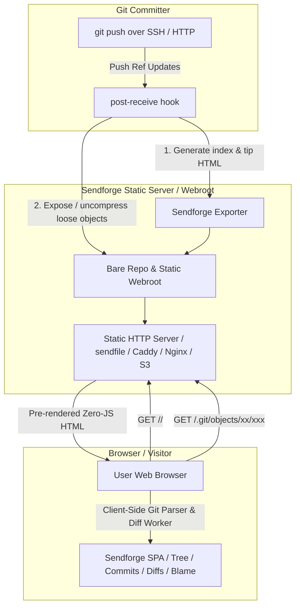

# Product Requirements Document (PRD)
## Project: Sendforge (`sendforge`)
**Status:** Approved  
**Version:** 0.1.0  
**Target Milestone:** MVP Release  

---

## 1. Executive Summary & Vision

**Sendforge** is a modern, high-performance, static-first Git forge named in homage to the Linux `sendfile(2)` syscall. It is architected from the ground up to eliminate dynamic backend compute bottlenecks, shrug off scraper and bot floods, and deliver sub-millisecond TTFB page loads.

By decoupling repository storage from application compute:
1. **The Server** acts as an ultra-fast static file provider (`sendfile(2)`-friendly HTTP / object storage / CDN) serving bare Git repository objects, packfiles, and lightweight pre-rendered HTML entrypoints.
2. **The Client** runs an in-browser Git engine (via TypeScript / WebAssembly) that dynamically fetches and resolves Git objects, trees, commits, and diffs on demand.
3. **Collaboration Data** (issues, patches, code reviews) is stored natively inside Git references or static manifests, enabling full offline and static-first operation without a traditional relational database backend.

---

## 2. Problem Statement & Motivation

Traditional Git forges (GitHub, GitLab, Gitea, SourceHut) rely on dynamic backend servers that execute heavy Git subprocesses (`git log`, `git cat-file`, `git diff`) and relational database queries on every HTTP request. 

### Key Pain Points:
1. **Vulnerability to Scraper & Bot Floods:** AI web crawlers and scrapers hammer dynamic endpoints, forcing forges to implement hostile anti-bot mechanisms (e.g., 10–90 second Proof-of-Work browser checks) or face degraded performance.
2. **Infrastructure Costs:** Running dynamic forges with database clusters and Git worker processes requires substantial memory and CPU overhead even for low-traffic personal or team repositories.
3. **All-or-Nothing Tradeoff:** Current alternatives force developers to choose between dynamic, resource-heavy platforms (Gitea/Forgejo) or primitive, non-interactive static generators (`stagit`).

---

## 3. Target Audience & Use Cases

* **Self-Hosters & Indie Hackers:** Developers who want a clean, self-hosted forge on cheap VPS instances, static hosts (Cloudflare Pages / S3 / R2), or home servers without maintaining Postgres/Redis.
* **Open Source Projects & Communities:** Projects seeking a public web presence that is immune to scraper-induced slowdowns and requires zero server-side maintenance.
* **Archival & Mirroring:** Long-term, immutable code archives with high read traffic and zero compute costs.

---

## 4. Architectural Overview



---

## 5. System Architecture & Data Model

### 5.1 Storage Layer (Bare Git Webroot)
* Repositories live in a static directory structure:
  ```text
  /srv/git/
  └── <owner>/
      └── <repo>.git/
          ├── HEAD
          ├── config
          ├── refs/
          ├── info/
          │   └── refs                       # Dumb HTTP server-info
          ├── objects/
          │   ├── [0-9a-f]{2}/[0-9a-f]{38}   # Loose objects (CORS enabled)
          │   └── pack/                      # Packfiles & indices
          └── static/                        # Pre-rendered static landing pages
              ├── index.html                 # Default branch tree & README fallback
              ├── log.html                   # Recent commits summary fallback
              └── meta.json                  # Repo metadata, branches, tags, stats
  ```
* A Git `post-receive` hook automatically:
  1. Updates dumb HTTP `info/refs` (via `git update-server-info`).
  2. Generates pre-rendered HTML for the default branch tip and README.
  3. Emits `meta.json` containing branch heads, tag pointers, and repository statistics.

### 5.2 Client-Side Git Engine (Browser)
* **Core Engine:** Pure TypeScript / WebAssembly Git reader capable of reading loose objects and packfile byte-ranges directly via `fetch()` requests.
* **Capabilities:**
  * Resolve commit hashes, trees, subtrees, and blobs.
  * Compute side-by-side and unified diffs client-side using Web Workers.
  * Dynamic syntax highlighting (via lightweight client highlighter).
  * Fast client-side fuzzy file finder (`Ctrl+K` / `T`).

### 5.3 Collaboration Layer (Issues & Pull Requests)
* **Storage:** Issues and pull requests are stored as structured Git refs (adopting or bridging `git-bug` and `refs/pull/*` patches).
* **Read-Model:** Fully static JSON export rendered during `post-receive` or resolved live from Git refs by the client engine.
* **Write-Model (Phase 2):**
  * Submissions via Git CLI (`git push`, `git bug push`).
  * Optional lightweight webhook / serverless gateway for browser submissions.

---

## 6. Functional Requirements

### 6.1 Phase 1: MVP (Code & History Browser) — COMPLETE ✅
- [x] **Repository Initialization & Discovery:** `sendforge init` sets up bare repos with dumb HTTP server-info and `post-receive` hooks.
- [x] **Pre-rendered Landing Pages:** Fast, zero-JS view of repository root, file tree, and rendered `README.md` via `pulldown-cmark`.
- [x] **In-Browser Repository Navigation:**
  - Fast branch and tag switching without full-page reloads.
  - Interactive file tree navigation and blob viewer with syntax highlighting and line numbers.
  - Commit history timeline with author metadata, commit messages, and signatures.
  - Interactive commit diff viewer (unified and split diffs) computed off-thread in a Web Worker.
- [x] **Git Push Integration:** `post-receive` hook updates `info/refs`, generates `meta.json`, and pre-renders static HTML fallbacks.
- [x] **Static Deployment Support:** `sendforge export` bundles bare repos, static fallbacks, and the client SPA for zero-compute hosting on S3, Cloudflare Pages, Caddy, or Nginx.

### 6.2 Phase 2: Enhanced Navigation & Refined UX — COMPLETE ✅
- [x] **Tabbed Ref Selector:** Separate Branches and Tags into dedicated tabbed selector panels with instantaneous filter/search instead of a combined dropdown.
- [x] **In-Browser `git blame`:** Client-side blame calculation tracing line origins across commit parent chains.
- [x] **Raw Blob Download & Archive Generation:** Client-side ZIP/tarball generation from Git tree objects.
- [x] **Line-Number Permalinks:** Highlight and share direct line links (`#L12-L34`) in the file viewer.

### 6.3 Phase 3: Git-Native Pull Requests & Issues — COMPLETE ✅
- [x] **`refs/pull/*` Patch & Pull Request Viewer:** Review patchsets submitted as Git refs with client-side 3-way merge base diff calculation.
- [x] **`git-bug` / Git-Ref Issue Viewer:** Client-side rendering of issue threads, labels, and status stored directly as Git references.
- [x] **Discussion / Review Comments:** Offline-first review notes stored in `refs/notes/reviews`.

---

## 7. Non-Functional Requirements

| Metric | Target |
| :--- | :--- |
| **Time to First Byte (TTFB)** | < 15ms (served purely as static assets) |
| **Server CPU on Scrape Flood** | < 5% CPU under heavy concurrent scraping |
| **Zero-JS Accessibility** | Core README and file tree viewable with JavaScript disabled |
| **Client Bundle Size** | < 35 KB gzipped for the complete SPA |
| **Safety Posture** | `#![forbid(unsafe_code)]`, zero-unwrap/expect, zero-`any` TypeScript |

---

## 8. Technology Stack Choices

* **Backend / CLI / Hook Tooling:** Rust (`sendforge` binary enforcing `#![forbid(unsafe_code)]`, strict Clippy deny list, `thiserror`).
* **Frontend UI:** TypeScript + Preact (reactive SPA, 32.48 kB gzipped).
* **Client-Side Git Parser:** Pure TypeScript binary loose object parsers (`commit`, `tree`, `blob`, `tag`) + Web Worker Myers LCS diff engine.
* **Styling:** Clean, minimalist dark-mode CSS with responsive layouts.
